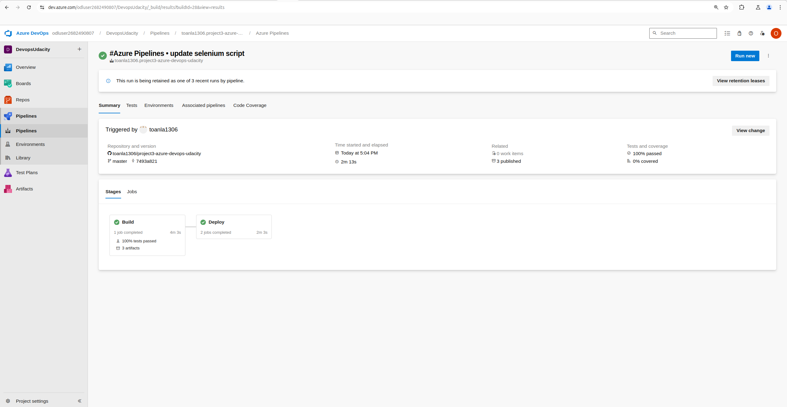
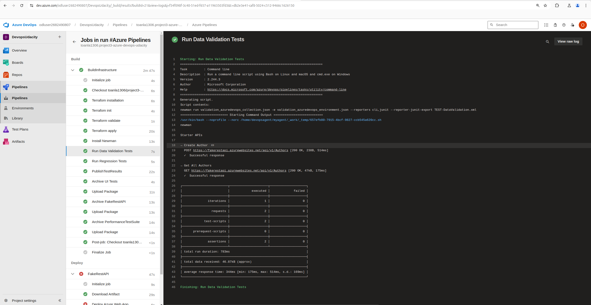
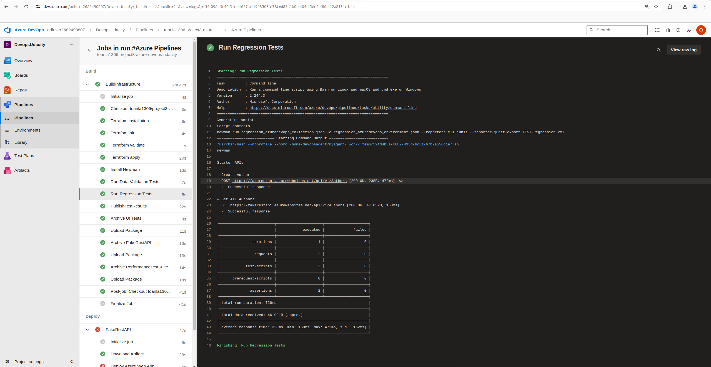
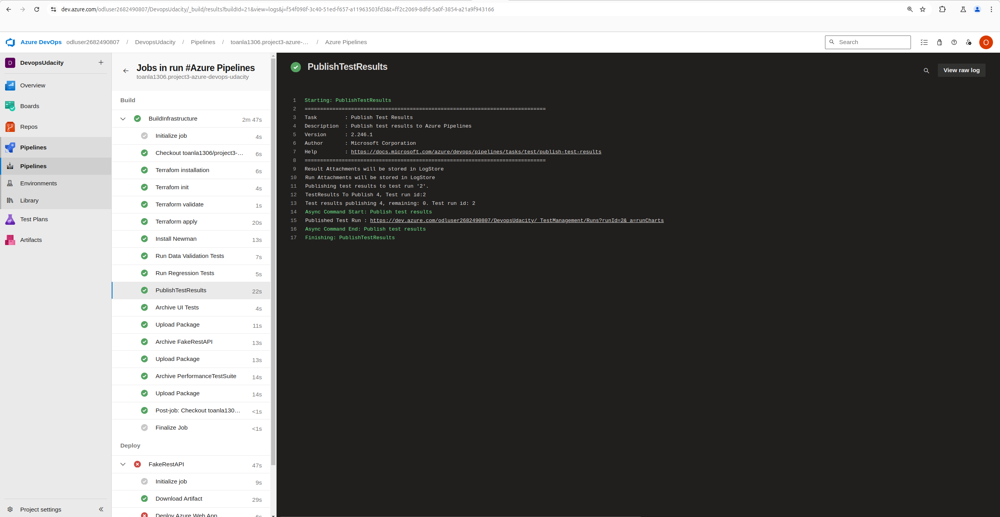
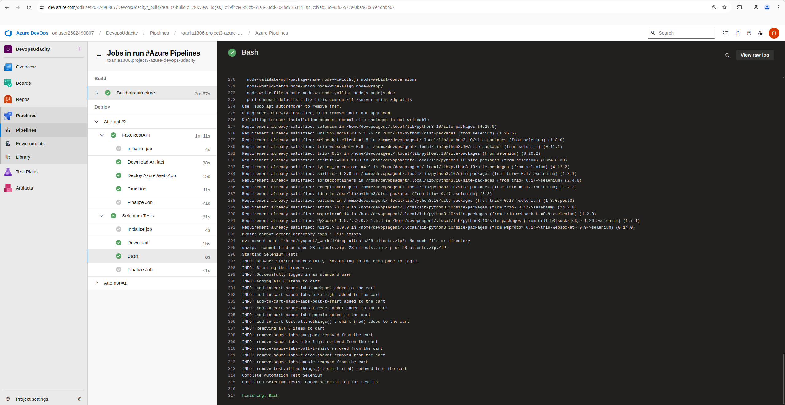
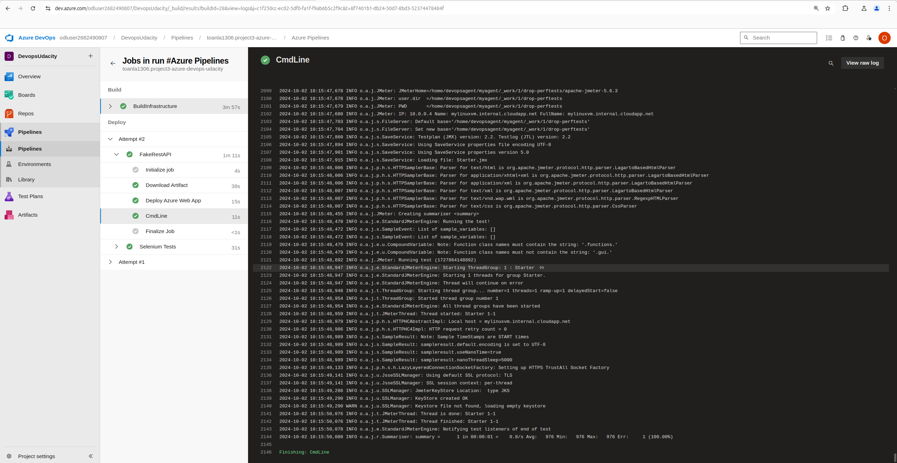
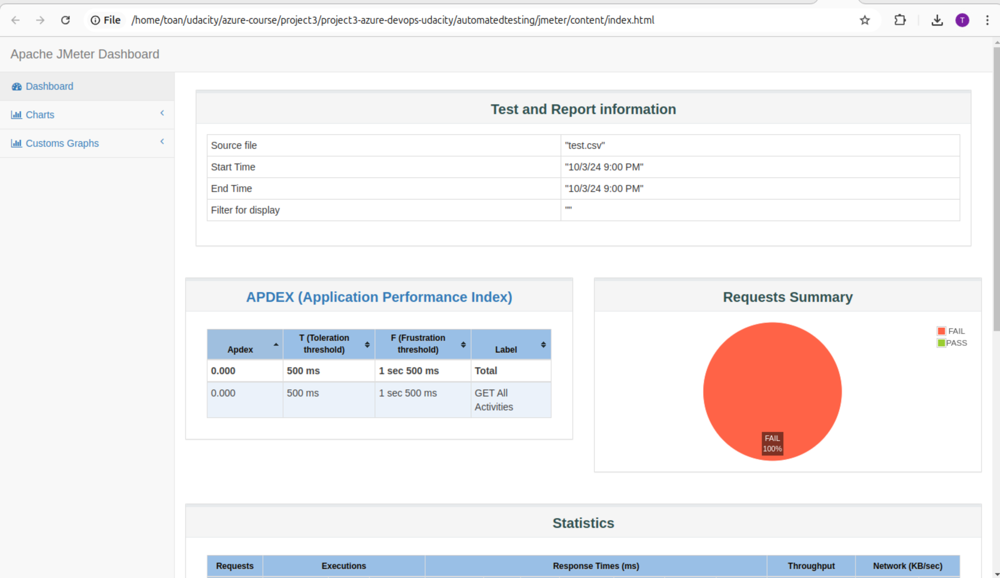
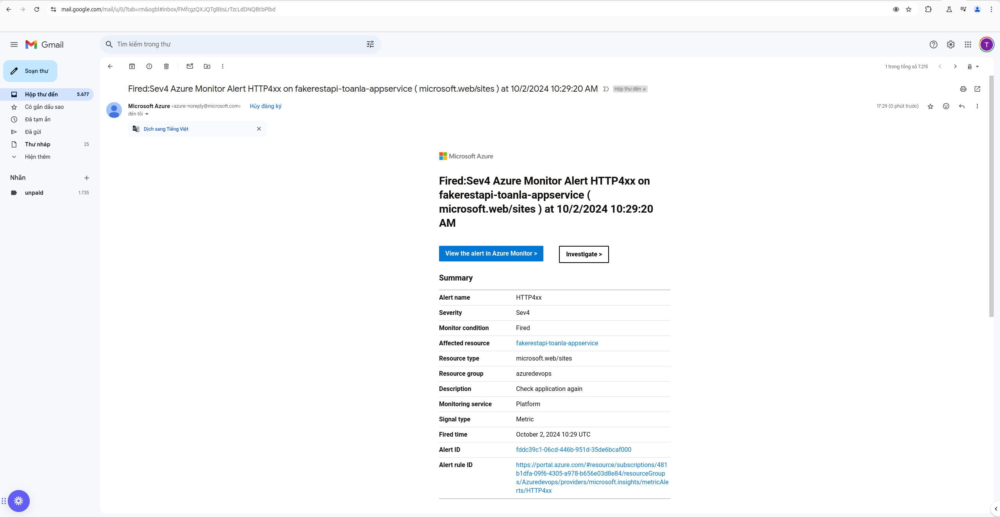
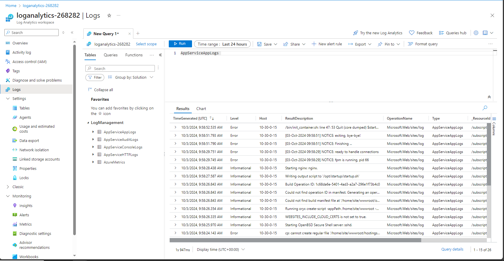

# project3-azure-devops-udacity

This repository contains the starter code for the **Ensuring Quality Releases** project of the cd1807 Ensuring Quality Releases (Quality Assurance) course taught by Nathan Anderson. 

## How to use?
- Fork this repository to your Github account and clone it locally for further development. 
- Follow the classroom instructions, and check the rubric before a submission. 

## Suggestions and Corrections
Feel free to submit PRs to this repo should you have any proposed changes. 

* A screenshot of the log output of Terraform when executed by the CI/CD pipeline (ensure the timestamp is visible by toggle timestamps for the specific).
    - CICD create infrastructure via Terraform in Azure Devops

        

* A screenshot of the successful execution of the pipeline (screen shot should be of the build results page)
    
    

* Postman Collections
    - One should be the Run Summary page

        

    - One should be of the Test Results page

        

    - One should be of the output of the Publish Test Results step.

        

* A screenshot of the successful execution of the Test Suite on a VM in Azure DevOps (Selenium)

    

* A screenshot of the log output of JMeter when executed by the CI/CD pipeline (JMeter)

    

    

* Screenshots of the email received when the alert is triggered

    

* Screenshot of Configure Azure Log Analystic

    